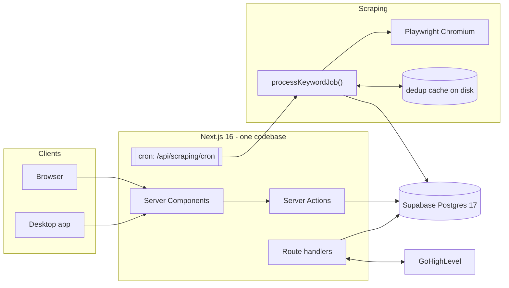

# DataForge

**A lead-generation platform that scrapes public business contact data from Google Maps,
deduplicates and scores it, and turns it into call-ready prospect lists for GoHighLevel —
plus the sales-floor tooling that runs on top of them.**

DataForge is one Next.js 16 application deployed two ways from the same source tree: a
shared web app on Vercel, and a Windows desktop app (Electron) that runs the scraper on a
real machine with a real residential IP. Both talk to the same Supabase Postgres database.

```
[Keyword schedule] → [Scrape job] → [Google Maps] → [3-layer dedup] → [Lead] → [GHL]
```

---

## Ground truth

| | |
|---|---|
| **The app you edit** | [`dataforge-app-lite/`](dataforge-app-lite/) |
| **Do not edit** | `dataforge-app/` — frozen backup, kept deliberately |
| **Stack** | Next.js 16 (App Router, Turbopack), React 19, TypeScript strict, Prisma 7, NextAuth v5, Tailwind v4, shadcn/ui |
| **Database** | Supabase Postgres 17, project `pbvwxyqbzmwoftxkzpoh`, region `ap-southeast-1` |
| **Connection** | Transaction pooler, **port 6543**. Port 5432 is blocked on the developer's ISP |
| **Deploy** | Vercel, functions pinned to `sin1` (beside the database) |
| **Desktop** | Electron wrapping the Next standalone server |
| **Scraping** | Playwright + headless Chromium |
| **Plan** | Supabase **Free** — 5 GB unified egress across Database, Auth, Storage, Realtime and Functions |
| **Scale** | ~261k rows, under 500 MB. `Lead` is ~132.7k of them |

---

## Documentation

| Document | What it covers |
|---|---|
| **[docs/ARCHITECTURE.md](docs/ARCHITECTURE.md)** | System design: runtime topology, module layering, request lifecycle, auth & RBAC, real-time, integrations, known gaps |
| **[docs/DATA_MODEL.md](docs/DATA_MODEL.md)** | ERD, all 45 models, dedup invariants, cascade behaviour, the expression indexes, quality scoring, migrations |
| **[docs/SCRAPING_PIPELINE.md](docs/SCRAPING_PIPELINE.md)** | The scraper, the job processor, the auto-run loop, rotation, the three dedup layers, the egress incident |
| **[docs/API_REFERENCE.md](docs/API_REFERENCE.md)** | Every route handler and server action, with auth requirements |
| **[docs/CODEBASE_GUIDE.md](docs/CODEBASE_GUIDE.md)** | File-by-file tour, conventions, and the traps that have already bitten |
| **[docs/OPERATIONS.md](docs/OPERATIONS.md)** | Env vars, local setup, deploy, desktop packaging, backup/restore, the egress budget, troubleshooting |
| **[CLAUDE.md](CLAUDE.md)** | ⚠️ **The Constitution** — nine rules that each exist because violating them broke something. Read before changing anything. |
| **[HANDOVER.md](HANDOVER.md)** | The 2026-08 Supabase migration and the egress incident, in narrative form |
| [DATAFORGE_PRD.md](DATAFORGE_PRD.md) | Product brief |
| [GHL_SYNC_PLAN.md](GHL_SYNC_PLAN.md) | GoHighLevel integration plan |
| [DataForge-SOP.pdf](DataForge-SOP.pdf) | Operator SOP |
| ~~CODEBASE_MAP.md~~ | ⚠️ Written 2026-04 and **partly stale** — it says the database is Neon. It is Supabase. Superseded by [docs/CODEBASE_GUIDE.md](docs/CODEBASE_GUIDE.md). |

---

## What it does

### Leads department
* **Automated scraping** — recurring keyword × location searches against Google Maps,
  with city rotation (population-ordered) and keyword rotation so one keyword can work a
  whole market over time.
* **Three-layer deduplication** — uniqueness is **phone OR business name**, never email.
* **Quality scoring** — 0–100 from field completeness, monotonically increasing.
* **Organisation** — categories → subcategories → folders, with per-user category grants.
* **Email enrichment** — post-scrape website crawl for contact addresses.
* **Export & GHL migration** — CSV export, direct contact push into GoHighLevel.
* **Duplicate resolution** — merge flow that reassigns commissions, calls and GHL links to
  the survivor before deleting.

### Marketing department
* Agent leaderboards, call-volume analytics and per-agent profiles.
* Call logs, appointments and opportunities mirrored from GoHighLevel.
* Commissions — rules, per-lead and per-rep ledgers, paid/confirmed lifecycle.
* Gamification — badges, call-count challenges, and a balloon-pop reward game.

### Shared
Dashboard · reports (with public share links) · kanban · calendar · chat · notes and call
scripts · team chat · feedback tracker · **Forger**, an in-app Claude assistant with tools
for searching leads, exporting CSVs and controlling scrapers · a **fleet view** where the
boss sees every online instance and can start or stop a scrape on someone else's machine.

---

## Architecture at a glance



Layering is strict and one-directional:
**page → component → action/route → service → Prisma.** All business logic and every
query live in `src/lib/<domain>/`; every server action opens with an RBAC guard.

---

## Quick start

```bash
cd dataforge-app-lite
npm install
npx playwright install chromium     # only if running scrapes locally

# create .env.local — minimum:
#   DATABASE_URL=postgresql://...@...pooler.supabase.com:6543/postgres
#   AUTH_SECRET=<random 32+ chars>

npx prisma generate
npm run dev                          # http://localhost:3000
```

First account: `npx tsx prisma/seed.ts` creates `boss@dataforge.dev` / `Password1234`.
**Change it immediately anywhere but local dev.**

> **Quit the desktop app before `npm run dev`.** Both bind port 3000, and the desktop app
> serves a *pre-built* bundle — so your changes silently do not appear, and it keeps using
> whatever database it launched with.

Full setup, env reference and scripts: **[docs/OPERATIONS.md](docs/OPERATIONS.md)**.

---

## The non-negotiables

These are the rules most likely to bite a new contributor. Each one exists because
violating it broke something real. The full set, with the amendment process, is in
**[CLAUDE.md](CLAUDE.md)**.

1. **Never read the whole `Lead` table in a request or job path.** One such line cost
   **86.6 GB of egress in a single billing cycle** and got the entire Supabase
   organisation restricted. Anything needing "all the leads" goes through
   `src/lib/scraping/jobs/dedup-cache.ts`.
2. **Lead uniqueness is phone OR business name — never email.** One telemetry address
   appears on 860 leads; 9,032 rows share an email with another lead.
3. **Do not remove a dedup layer.** The local cache, `checkDuplicate()` and the unique
   indexes each do a different job.
4. **Do not touch the scraper or the auto-keyword loop** (`src/lib/scraping/google/`,
   `runKeywordAutoLoop`, `processKeywordJob` control flow, `keywords/service.ts`, the cron
   route) without an explicit, by-name request. If `git diff` on
   `src/lib/scraping/google/` is not empty, you have gone too far.
5. **Resolving duplicates is a merge, never a bare delete** — `LeadCommission` cascades,
   and that is money data.
6. **Keep `ensure-dedup-indexes.mjs` wired into the build.** Three expression indexes
   cannot be expressed in Prisma's schema language, and `prisma db push` drops them.
7. **Do not tighten the connection pool.** It is tuned for a slow link.
8. **Secrets never enter committed files.** `.env*` is gitignored, and desktop builds bake
   the env file in — rotating the DB password breaks every installed desktop app until
   it is rebuilt.

---

## Contributing

* **Follow the layering.** Business logic belongs in a service, not in a page or an action.
* **Guard every server action** with `requireDepartment(...)` / `requireRole(...)`.
* **Count round trips, not rows.** The data is small; every serious problem here has been
  an access-pattern problem. Prefer one query with `FILTER` over N counts, and cache page
  aggregates with `unstable_cache` + `updateTag`.
* **Comment the *why***, especially for anything a future reader would be tempted to
  "clean up".
* **Verify against real data before shipping a rule.** Every number in CLAUDE.md came from
  querying the actual database.

---

## Recent updates — 15 September 2026

**1. Full written guide to the app.** Produced complete documentation covering how DataForge
is built, how its data is organised, and how leads are collected and cleaned. A new developer
can now get up to speed from the documents alone, instead of needing someone to walk them
through it.

**2. The desktop app now updates itself.** Previously, every new feature or fix meant
uninstalling and reinstalling the app by hand on each person's computer. It now checks for
updates on its own and installs them quietly, without interrupting anyone's work.

**3. Automated safety checks added.** Set up an automatic reviewer that checks new work
against the mistakes that have already cost this project money, before those mistakes can go
live. It found a genuine problem on its very first run.

**4. Security issue found and flagged.** Discovered that some old database passwords and a
live connection link were saved somewhere publicly visible. There is no sign anything was
misused, but they should be changed as a priority.

**5. Release process built and tested.** Built the system that packages the desktop app and
delivers it to the team, and completed a full trial run successfully. Nothing was released to
anyone — the test confirmed the process works before it is used for real.
