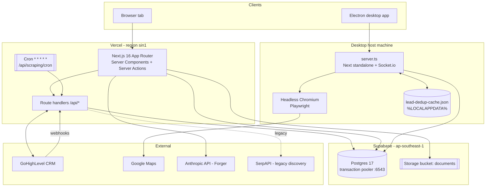
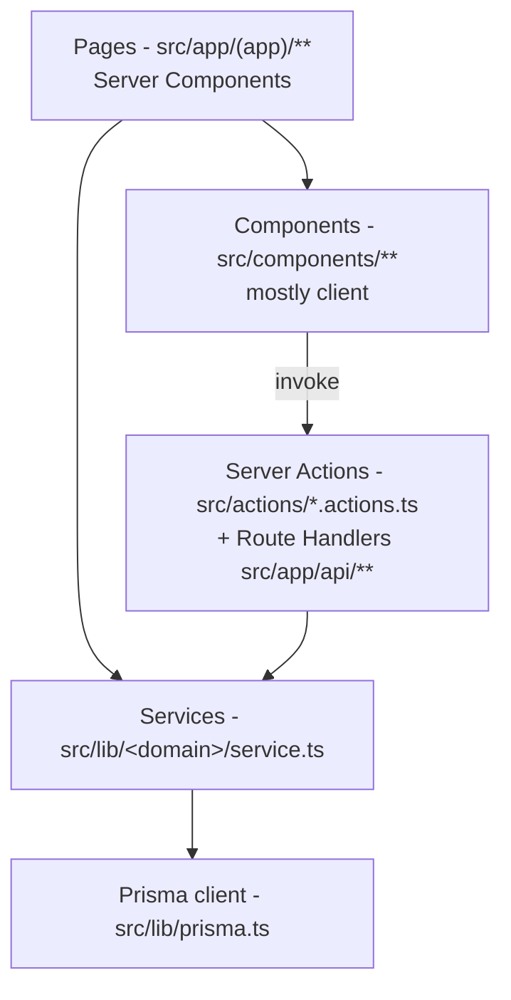
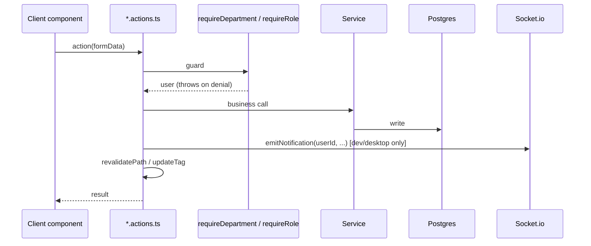

# DataForge — System Design & Architecture

> Companion to [`../README.md`](../README.md). Covers runtime topology, the request
> lifecycle, module layering, authentication, authorization and real-time transport.
> For the database see [`DATA_MODEL.md`](DATA_MODEL.md); for the scraper see
> [`SCRAPING_PIPELINE.md`](SCRAPING_PIPELINE.md).

---

## 1. What the system is

DataForge is a **single Next.js application** deployed twice, from the same source tree,
into two different runtimes:

| Runtime | How it runs | What it is for |
|---|---|---|
| **Web (Vercel)** | Next.js serverless functions pinned to `sin1`, plus a 1-minute cron | The shared app everyone signs into; the always-on scrape scheduler |
| **Desktop (Electron)** | `electron/main.js` spawns the Next **standalone** server as a child process on `localhost:3000`, then opens a `BrowserWindow` against it | Running the Google Maps scraper on a real machine with a real residential IP, and keeping it alive in the tray |

Both runtimes talk to the **same Supabase Postgres database**. There is no separate API
tier, no message broker, no worker fleet — the "worker" is the Next.js runtime itself
(a cron-invoked serverless function on web, an in-process loop on desktop).



---

## 2. Runtime topology

### 2.1 Web / Vercel

* `vercel.json` pins functions to **`sin1`** — the same region as the Supabase project
  (`ap-southeast-1`). Cross-region round trips on a chatty ORM were the original latency
  problem; co-location is deliberate.
* Build command:
  `prisma generate && prisma db push --accept-data-loss && node scripts/migration/ensure-dedup-indexes.mjs && next build`.
  The `ensure-dedup-indexes` step is **load-bearing** — see
  [`DATA_MODEL.md` §5](DATA_MODEL.md#5-the-expression-indexes-prisma-cannot-express).
* A cron hits `/api/scraping/cron` every minute. That route is the scheduler: it reaps
  dead jobs, enforces the auto-run time limit and enqueues due keyword scrapes up to a
  concurrency cap.
* Socket.io is **not available on Vercel** — `server.ts` is used only by `npm run dev`,
  `npm run start` and the desktop build. On Vercel, notification delivery degrades to
  ordinary page revalidation.

### 2.2 Desktop / Electron

`electron/main.js`:

1. Spawns the Next standalone server (`.next/standalone/server.js`) using Electron's own
   Node runtime (`ELECTRON_RUN_AS_NODE=1`) — no system Node, npm or `tsx` needed in the
   packaged app.
2. Polls the port until it answers HTTP, then opens the window at `http://localhost:3000`.
3. Closing the window **hides to the tray** rather than quitting, so a running scrape
   survives. Only the tray "Quit" really exits.
4. Writes startup milestones to `<userData>/launch-timing.log`.

`electron/assemble.mjs` bakes the env file into the packaged build. **Rotating the
database password therefore breaks every installed desktop app until it is rebuilt**
(CLAUDE.md C9).

> **Port-3000 trap.** The desktop app and `npm run dev` both bind port 3000, and the
> desktop app serves a *pre-built* bundle. If a code change "isn't showing up", quit the
> desktop app first. It also holds DB connections from whenever it launched, so after an
> env change it keeps using the old database.

### 2.3 Database connectivity

`src/lib/prisma.ts` builds a `PrismaClient` over a `pg` `Pool`, tuned for a slow, lossy
link to `ap-southeast-1`:

| Setting | Value | Why |
|---|---|---|
| `max` | 15 | Must exceed the widest `Promise.all` in the app — `getAgentProfile` fires 12 parallel queries. A pool of 10 produced *timeout exceeded when trying to connect*. |
| `idleTimeoutMillis` | 60 000 | `pg` defaults to 10 s; a cold connect here costs 0.5–2.7 s, so the default meant constant re-dialling |
| `keepAlive` | `true` | Stops idle connections being silently dropped mid-path |
| `connectionTimeoutMillis` | 30 000 | Cold connects over a degraded path take seconds |

`CLIENT_VERSION` in that file busts the dev hot-reload singleton — **bump it whenever you
change pool or client construction**, or dev keeps serving the old client.

`withDbRetry(fn)` retries once on anything that is *not* a Prisma `P2xxx` (data/query)
error. Use it around anything exposed to the network's roughly one-in-six connect failure
rate, especially `Promise.all` fan-outs.

`src/instrumentation.ts` fires a background `SELECT 1` at server boot to warm the pool
**without awaiting it** — Next.js awaits `register()`, so awaiting there would block the
server (and the desktop window) behind the SSL handshake.

There is also a Neon branch in `createPrismaClient()` (`@prisma/adapter-neon`), kept as a
fallback for connection strings containing `neon.tech`. **Production is Supabase**; the
Neon path is legacy.

---

## 3. Application layering

Four layers, dependency direction strictly downward.



| Layer | Responsibility | Must not |
|---|---|---|
| Page (`page.tsx`) | Auth/role gate, fetch via services, render | Hold business rules or ad-hoc Prisma queries |
| Component | Presentation and local state | Import Prisma or server-only modules |
| Action / route handler | Guard, validate, call services, revalidate cache | Contain business rules |
| Service (`src/lib/<domain>/`) | All business logic and every query | Know about HTTP, `next/headers` or React |

Server actions live in `src/actions/*.actions.ts` and **always** open with an RBAC guard
from `src/lib/rbac/guards.ts`. Route handlers under `src/app/api/**` exist for what
actions cannot serve: webhooks, SSE streams, cron, file uploads, and anything called by a
non-React client (the desktop heartbeat, GHL).

---

## 4. Request lifecycle

### 4.1 A page load

```mermaid
sequenceDiagram
    participant U as Browser
    participant M as proxy.ts (NextAuth middleware)
    participant L as (app)/layout.tsx
    participant P as page.tsx
    participant G as rbac/guards
    participant S as Service
    participant DB as Postgres

    U->>M: GET /leads
    M->>M: authorized() - session JWT present?
    alt not signed in, non-public path
        M-->>U: 302 /sign-in
    end
    M->>L: render
    L->>L: auth(); redirect if no session
    L->>L: getDisabledFeatures() - boss feature toggles
    L->>P: children
    P->>G: requireDepartment("leads")
    G->>DB: user row (via withDbRetry)
    P->>S: getLeads(...) / getCategoryGrants(userId)
    S->>DB: scoped queries
    P-->>U: streamed RSC payload
```

Middleware (`src/proxy.ts` + `src/auth.config.ts`) enforces **authentication only** — it
is edge-compatible, so it may not import Prisma or bcrypt. **Authorization is enforced in
server components and actions**, never in middleware.

### 4.2 A mutation (server action)



> **Next.js 16 cache API.** `revalidateTag(tag)` now requires a second argument. Inside a
> server action use **`updateTag(tag)`** for read-your-own-writes.

### 4.3 Real-time

`server.ts` wraps the Next handler in a plain `http` server and attaches Socket.io at
`/api/socket`. Each client joins a personal room `user:<id>`; `src/lib/socket/emit.ts`
reads the server off `global.__socketIO` and emits into those rooms. Because this needs a
long-lived process, it works in `npm run dev`, `npm run start` and the desktop app — **not
on Vercel**.

Two polling channels complement it:

* **Presence / fleet** — every open instance POSTs `/api/instances/heartbeat` roughly
  every 8 s. That upserts its `AppInstance` row *and returns any pending `RemoteCommand`
  rows* the boss queued for that device. This is how "boss starts a scrape on someone
  else's machine" works: the target device executes it locally, so the scrape runs on that
  device's IP. `/api/instances/leave` fires via `navigator.sendBeacon` on close so the
  fleet view drops the row immediately instead of waiting out the ~30 s timeout.
* **Job progress** — `/api/scraping/stream` and `/api/scraping/google-stream` are SSE
  endpoints driving the scraping UI.

---

## 5. Authentication & authorization

### 5.1 Authentication

NextAuth v5 (`src/lib/auth.ts`): **credentials provider only** (email + bcrypt hash),
**JWT session strategy**, with `PrismaAdapter` backing the `Account` / `Session` /
`VerificationToken` tables.

The user's `role` is written into the JWT at sign-in and refreshed only on an explicit
`trigger === "update"`, so an admin changing someone's role needs that user's session
updated before it takes effect.

The split config is deliberate:

* `src/auth.config.ts` — edge-safe (no Prisma, no bcrypt), imported by middleware.
* `src/lib/auth.ts` — the full Node config with adapter and password comparison.

Public paths (no session): `/`, `/sign-in`, `/sign-up`, `/share/**`, `/api/auth/**`,
`/api/health/**`, `/api/scraping/cron`, `/api/webhooks/**`, `/api/ghl/outbound-call`,
`/api/ghl/inbound-call`.

### 5.2 Roles and departments

`src/lib/rbac/roles.ts` is the single source of truth. Five roles map onto two
departments:

| Role | Departments | Can create | Can change settings |
|---|---|---|---|
| `boss` | leads, marketing | every role | ✅ |
| `admin` | leads, marketing | all except `boss` | ❌ |
| `team_lead` | marketing | — | ❌ |
| `sales_rep` | marketing | — | ❌ |
| `lead_specialist` | leads | — | ❌ |

Guards in `src/lib/rbac/guards.ts`: `requireAuth()`, `requireRole(...roles)`,
`requireDepartment(dept)`, and `getSessionRole()` (JWT-only, no DB round trip).

### 5.3 Row-level scoping

Roles are coarse. Two finer, **default-deny** grant tables narrow what a
`lead_specialist` actually sees:

* **`CategoryAccess`** → which lead categories (industries) are visible.
  `src/lib/leads/access.ts` turns grants into a Prisma `where` fragment
  (`leadAccessWhere`); with no grants it deliberately matches nothing
  (`{ id: "__no_category_access__" }`). `industryId = null` means the "Uncategorized"
  bucket — folders with no category plus leads in no folder.
* **`KeywordAccess`** → which auto-scrape keywords are visible and runnable
  (`src/lib/keywords/access.ts`).

`boss` and `admin` bypass both (`hasFullLeadAccess`).

### 5.4 Feature toggles

`AppSettings.disabledFeatures` (a `String[]`) hides whole areas of the app from everyone.
`src/lib/features.ts` is client-safe and maps nav hrefs to feature keys so the sidebar and
the settings UI share one definition; `src/lib/features-guard.ts` reads it server-side.

---

## 6. External integrations

| System | Direction | Where |
|---|---|---|
| **GoHighLevel** | outbound: contact create/update, call/appointment/opportunity pulls | `src/lib/ghl/client.ts`, `sync.ts`, `mapping.ts`, `match-rep.ts` |
| **GoHighLevel** | inbound: webhooks for leads, appointments, call events | `/api/webhooks/ghl-lead`, `/api/webhooks/ghl-appointment`, `/api/ghl/inbound-call`, `/api/ghl/outbound-call` |
| **Google Maps** | outbound scrape via Playwright Chromium | `src/lib/scraping/google/maps-scraper.ts` |
| **Anthropic** | Forger in-app assistant; scraped-image vision | `/api/forger/chat`, `/api/scraping/image`, `src/lib/forger/**` |
| **Supabase Storage** | note/script file uploads (`documents` bucket) | `/api/upload/document`, `src/actions/documents.actions.ts` |
| **SerpAPI** | legacy discovery path, only when `SERPAPI_API_KEY` is set | `src/lib/scraping/google/discovery.ts` |

GHL credentials (`ghlApiKey`, `ghlSubAccountApiKey`, `ghlLocationId`, `ghlInboundSecret`)
live in the **`AppSettings` singleton row**, not in env vars, so the boss can rotate them
from the settings UI. Sync watermarks (`ghlCallsLastSyncedAt`, `ghlOppsLastSyncedAt`,
`ghlAppsLastSyncedAt`) live there too.

---

## 7. Cross-cutting concerns

### 7.1 Egress is a first-class budget

The Supabase Free plan gives **5 GB of unified egress** (Database + Auth + Storage +
Realtime + Functions combined). One full-table read in a hot path once cost **86.6 GB in a
single billing cycle** and got the whole organisation restricted. What that turned into
architecture, not preference:

* **Never `findMany` the whole `Lead` table in a request or job path.** Anything needing
  "all the leads" goes through `src/lib/scraping/jobs/dedup-cache.ts`.
* Prefer **one query with `FILTER`** over N `count()` calls —
  `src/lib/dashboard/service.ts` is the model to copy.
* Cache page-level aggregates with `unstable_cache` + a tag, purged by `updateTag` on
  write (`getDashboardStats`, `getTeamSummary`, `getDuplicateGroupCount`).
* Pull heavy optional payloads **on demand only** — the globe's coordinates come from
  `/api/leads/locations` when the user opens it, not with the Leads page.

Count round trips before you count rows. The dataset is small (~261k rows, under 500 MB);
every serious problem here has been an access-pattern problem, not a scale one.

### 7.2 Error handling and degradation

* `withDbRetry` for transient connect failures.
* `/api/health/db` is a never-throwing reachability probe backing the `DbReconnect`
  screen.
* Scraper failures are contained: one keyword's failure never breaks the auto-loop, and a
  failed email grab never fails the scrape.
* Job liveness is a **heartbeat**: a healthy job writes progress after every lead
  (≤ ~40 s apart), so anything `running`/`pending` untouched for > 3 minutes is reaped as
  dead — by the cron on web, by the auto-loop itself on desktop.

### 7.3 Client conventions worth knowing

* **Lite Mode** — `data-lite` on `<html>` freezes all animation *by design*. If an
  animation "doesn't work", check this first; it is a user setting, not a bug.
* React lint blocks `setState` inside an effect (`react-hooks/set-state-in-effect`). For
  DOM or external state use `useSyncExternalStore` — `ThemeToggle.tsx` is the reference
  implementation.
* A `{/* comment */}` immediately before the root element of a `return (` breaks JSX (two
  siblings). Put it above the `return`.

---

## 8. Known architectural gaps

1. `prisma db push --accept-data-loss` runs on **every** deploy; the expression indexes
   are re-asserted afterwards by a script. Moving the build to `prisma migrate deploy` is
   preferred — the history is baselined — but must first be verified from a network where
   the Prisma CLI can reach port 5432.
2. `DbNotification` has 77k+ rows and nothing prunes it.
3. `getAgentProfile` fans out into 12 parallel queries — 5 × `callLog.count` and
   3 × `callLog.aggregate` — then runs a `$queryRaw` and a `callLog.findMany` outside the
   batch: **10 CallLog round trips for one profile page.** The outstanding `FILTER`-rewrite
   candidate.
4. `AppSettings.scrapingMaxRunMinutes` defaults to `0` — no ceiling on the auto-run loop.
5. Socket.io real-time silently does nothing on Vercel.
6. `CODEBASE_MAP.md` (written 2026-04) had its stack table corrected on 2026-09-15, but the
   rest of the file has not been re-verified. `REPORT.md` is a 2026-03 session log and is
   marked historical. Both are superseded by `docs/CODEBASE_GUIDE.md`.
7. 🔴 **Seven credentials sit in public git history** — six `neondb_owner` Postgres strings
   across both apps' `get-feedback.mjs` / `setup-vercel-env.sh`, plus a GHL webhook trigger
   URL from `91a67fa`. Rotation is the fix; redaction does not reach history.
