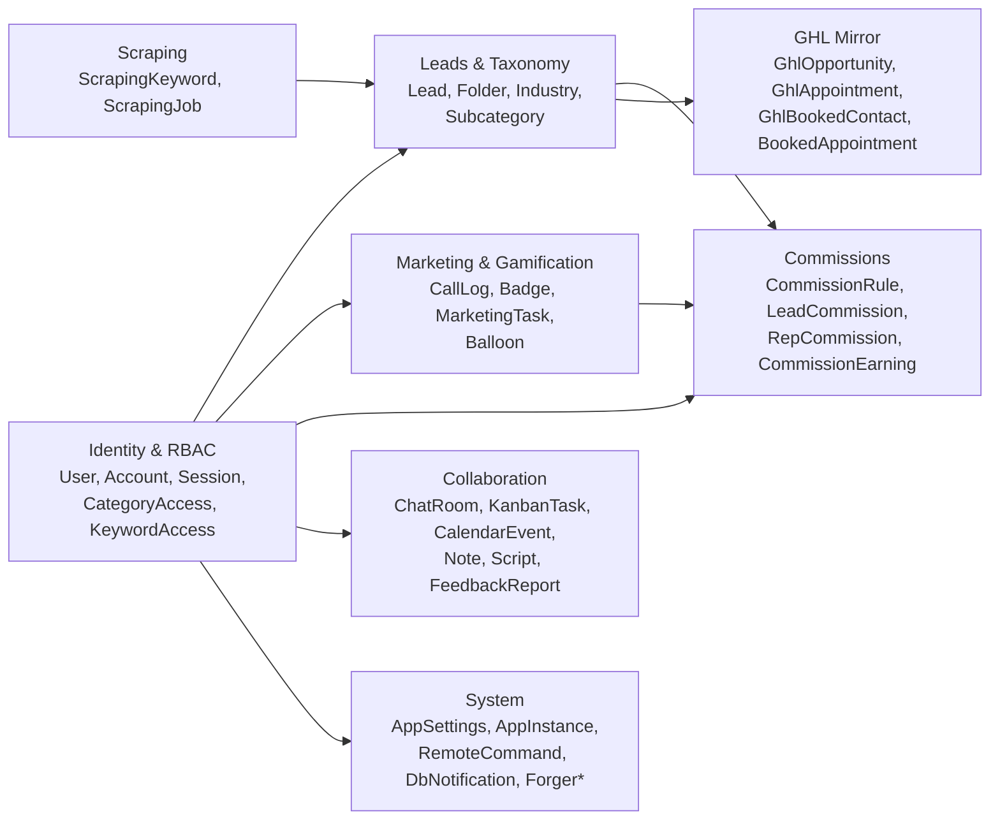
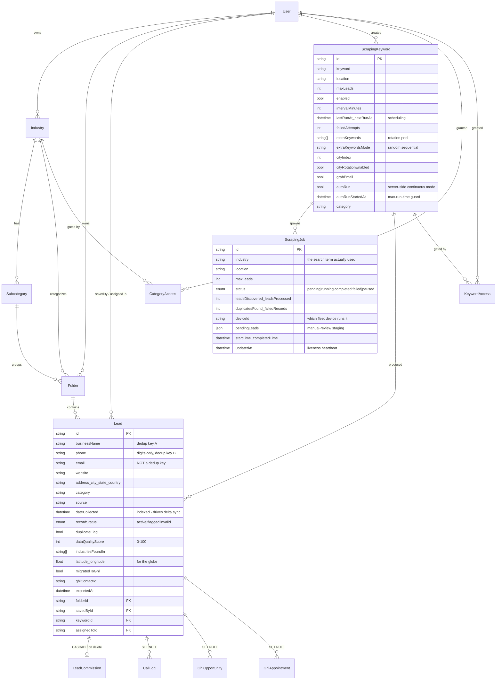

# DataForge — Data Model & ERD

> Source of truth: [`dataforge-app-lite/prisma/schema.prisma`](../dataforge-app-lite/prisma/schema.prisma)
> (45 models, 12 enums) plus three **expression indexes that live only in raw SQL** (§5).
> Database: **Supabase Postgres 17**, project `pbvwxyqbzmwoftxkzpoh`, region
> `ap-southeast-1`, reached through the **transaction pooler on port 6543**.

Scale as of the 2026-08 migration: **~261k rows across 43 tables, under 500 MB**, of which
`Lead` is ~132.7k and `DbNotification` 77k+.

---

## 1. Domain map

The schema splits into seven domains. Everything hangs off `User` (identity) and `Lead`
(the product's actual asset).



---

## 2. Core ERD — leads, taxonomy and scraping

This is the part of the schema that matters most; the rest is conventional.



### Why `Lead` looks the way it does

| Decision | Reason |
|---|---|
| `phone` stored **digits-only** | `normalizePhone()` strips non-digits and returns `""` below 7 digits. Storing normalized makes the unique expression index and the equality lookup both cheap. |
| `email` is indexed but **never a dedup key** | One Wix telemetry address appears on **860** leads, `user@domain.com` on **629**, and **9,032** rows share an email with another lead. Keying on it merges unrelated businesses. Tried, reverted. |
| `businessName` **not globally unique** | 16 names legitimately belong to different businesses (two `bp` filling stations with different numbers), and directory scrapes routinely produce several leads sharing one site-derived name. |
| `industriesFoundIn: String[]` | A business found under several search categories merges into one row and accumulates categories; it feeds the cross-industry bonus in the quality score. |
| `dateCollected` indexed | It is both the default list sort and the cursor for the dedup cache's delta sync. |
| `latitude` / `longitude` nullable | Geocoded best-effort at insert; `/api/leads/geocode-backfill` fills gaps. Only the globe uses them. |
| `exportedAt` | Lets "export only what I haven't exported" work without a join table. |

---

## 3. Deduplication invariants

**A lead is a duplicate when *either* key matches: normalized phone OR case-insensitive,
trimmed business name.** Both are checked on every insert — never in priority order.

An earlier version short-circuited on phone (falling back to name only when no phone was
present), so a lead carrying a phone number was never name-checked and the same business
scraped with two different numbers landed twice.

`checkDuplicate()` in [`src/lib/utils/dedup.ts`](../dataforge-app-lite/src/lib/utils/dedup.ts)
is a single raw SQL query so **both comparisons hit their indexes**:

```sql
SELECT "id" FROM "Lead"
WHERE ($1::text <> '' AND "phone" = $1::text)
   OR ($2::text <> '' AND lower(btrim("businessName")) = $2::text)
LIMIT 1
```

* The `::text` casts are required — otherwise Postgres reports *could not determine data
  type of parameter*.
* The empty-string guards are essential: **6,951 leads have a blank phone**, so an
  unguarded `"phone" = ''` would report every one of them as a duplicate.
* Prisma's `mode: "insensitive"` compiles to `ILIKE`, which no btree index can serve —
  that would seq-scan the whole table on every insert. Hence raw SQL.

On a duplicate, `insertLead()` **merges** rather than skipping: it unions
`industriesFoundIn`, keeps `dataQualityScore` monotonic (`Math.max`), sets
`duplicateFlag`, and moves the row if a folder was explicitly provided.

---

## 4. Cascade behaviour — read before deleting a lead

`mergeDuplicates()` reassigns all four children to the survivor **before** deleting, and
**refuses** when two copies both carry a commission (because `LeadCommission.leadId` is
`@unique`, one would have to be destroyed). Keep that refusal.

| Child of `Lead` | On delete | Damage if deleted blindly |
|---|---|---|
| `LeadCommission.leadId` (`@unique`) | **CASCADE** | Commission record destroyed — **money data** |
| `CallLog.leadId` | SET NULL | Call history orphaned |
| `GhlOpportunity.leadId` | SET NULL | GHL pipeline link broken |
| `GhlAppointment.leadId` | SET NULL | GHL appointment link broken |

Other cascade paths worth knowing: deleting a `Folder` **cascades to its leads**
(`Lead.folderId` is `onDelete: Cascade`), and so does deleting a `ScrapingKeyword`
(`Lead.keywordId` is `onDelete: Cascade`). Deleting a `User` cascades through nearly every
owned entity but only nulls their lead links (`savedBy` / `assignedTo` have no cascade).

---

## 5. The expression indexes Prisma cannot express

Three indexes use SQL expressions that **Prisma's schema language cannot represent**, so
they exist only in raw SQL migrations — and `prisma db push` will drop them as drift.

| Index | Definition | Job |
|---|---|---|
| `Lead_business_name_key_idx` | `(lower(btrim("businessName")))` — **not** unique | Serves the name half of `checkDuplicate()`. Deliberately non-unique: a hard constraint would permanently reject a genuinely different business with a colliding name. |
| `Lead_phone_normalized_key` | `UNIQUE ((regexp_replace("phone",'\D','','g'))) WHERE length(...) >= 7` | The real uniqueness guarantee for the ~94.8% of leads with a usable phone. Closes the concurrent-insert race `checkDuplicate()` cannot (it only reads committed rows). |
| `Lead_name_nophone_key` | `UNIQUE (lower(btrim("businessName"))) WHERE length(regexp_replace("phone",'\D','','g')) < 7` | Same guarantee for the ~5.2% (6,951 rows) with no usable phone. Scoped to phoneless rows because among *those*, zero names collide. |

`vercel.json` therefore runs `scripts/migration/ensure-dedup-indexes.mjs` after the
build's `prisma db push`. **Keep that step wired in.** The script is `IF NOT EXISTS` and
never fails the build — a failure there means real duplicate phone numbers need cleaning
up, which is a data task, not a reason to block a deploy.

`insertLead()` catches the resulting `P2002` and re-runs `checkDuplicate()` so a lost race
still returns the winning row's id rather than an error.

---

## 6. Enums

| Enum | Values | Note |
|---|---|---|
| `UserRole` | `boss`, `admin`, `team_lead`, `sales_rep`, `lead_specialist` | |
| `CallDirection` | `inbound`, `outbound` | |
| `CallStatus` | `completed`, `missed`, `voicemail`, `no_answer` | **Not** `answered`. Check `enum_range` before writing test data. |
| `RecordStatus` | `active`, `flagged`, `invalid` | Lead lifecycle |
| `JobStatus` | `pending`, `running`, `completed`, `failed`, `paused` | `paused` is how cancellation is signalled to a running scrape |
| `JobSource` | `serpapi`, `manual` | Historical — keyword jobs are still recorded as `serpapi` even though they use the Playwright scraper |
| `FeedbackType` | `bug`, `feature` | |
| `FeedbackStatus` | `open`, `in_review`, `resolved`, `closed` | |
| `KanbanColumn` | `backlog`, `in_progress`, `in_review`, `done` | |
| `KanbanPriority` | `low`, `medium`, `high` | |
| `NotifType` | `success`, `info`, `warning`, `error` | |
| `ChatRoomType` | `general`, `group`, `direct`, `announcement` | |

---

## 7. Table reference by domain

### Identity & access

| Model | Purpose |
|---|---|
| `User` | Everything. Auth fields, `role`, points, ban state, balloon state, GHL user link (`ghlUserId`). |
| `Account`, `Session`, `VerificationToken` | NextAuth adapter tables. Session strategy is JWT, so `Session` is largely vestigial. |
| `CategoryAccess` | Default-deny grant: which lead category a user may see. `industryId = null` = the Uncategorized bucket. |
| `KeywordAccess` | Default-deny grant: which scraping keyword a user may see/run. |

### Leads & taxonomy

| Model | Purpose |
|---|---|
| `Industry` | Top-level category (colour-coded), owned by a user. |
| `Subcategory` | Optional second level under an `Industry`. |
| `Folder` | The bucket leads actually sit in; optionally tagged with industry + subcategory. Keyword scrapes route into a shared "Ungrouped" folder per category. |
| `Lead` | The product. See §2–§4. |

### Scraping

| Model | Purpose |
|---|---|
| `ScrapingKeyword` | A recurring search definition: term + location + interval + rotation settings + `autoRun`. |
| `ScrapingJob` | One execution. `updatedAt` doubles as a liveness heartbeat; `deviceId` records which fleet machine ran it; `pendingLeads` stages manual-review results awaiting `/commit`. |

### Marketing & gamification

| Model | Purpose |
|---|---|
| `CallLog` | Calls, mostly mirrored from GHL (`ghlMessageId` is unique for idempotency). |
| `Badge` / `UserBadge` | Achievement definitions and awards. Badge images are base64 data URLs in the DB — no storage dependency. |
| `MarketingTask` / `TaskProgress` | Call-count challenges with point rewards. |
| `Balloon` / `BalloonAuditLog` | The balloon-pop reward game: fixed positions, prizes, pop and payout state, plus an audit trail for every admin adjustment. |

### Commissions

| Model | Purpose |
|---|---|
| `CommissionRule` | Reusable rule: type, amount, optional milestone target, period. |
| `LeadCommission` | Per-lead payout to an agent. `leadId` is **unique** — one commission per lead, which is why merges refuse when both copies have one. Flow: `pending` → paid by boss → confirmed received by agent. |
| `RepCommission` | Payout to a sales rep not tied to a specific lead. |
| `CommissionEarning` | Rule-derived earnings per user per period (`@@unique([userId, ruleId, period])`). |

### GHL mirror

| Model | Purpose |
|---|---|
| `GhlOpportunity` | Pipeline opportunities by owning agent; `ghlId` unique. |
| `GhlAppointment` | Calendar events by owning agent; `ghlId` unique. |
| `GhlBookedContact` | Contacts carrying the `appointment-booked` tag. |
| `BookedAppointment` | DataForge's own appointment record (manual or webhook). `@@unique([clientPhone, bookedAt])` dedupes replayed webhooks. |

All four link back to a `User` via GHL's contact owner (`src/lib/ghl/match-rep.ts`) and
optionally to a `Lead`.

### Collaboration

`ChatRoom` / `ChatRoomMember` / `ChatMessage`, `KanbanTask` / `KanbanComment`,
`CalendarEvent`, `FeedbackReport` / `FeedbackComment`, `Note` / `NoteFile`,
`Script` / `ScriptFile`. Notes and scripts store TipTap documents as `Json` and support
public read-only sharing through a nullable unique `shareToken` (served by
`/share/[token]`).

### System

| Model | Purpose |
|---|---|
| `AppSettings` | **Singleton** (`id = "singleton"`). Company name, scraping defaults and guards, quality thresholds, currency, IANA `timezone`, GHL credentials and sync watermarks, balloon rules, `disabledFeatures`, Forger API key/model/token cap, `reportsShareToken`. |
| `AppInstance` | One row per running instance (browser tab or desktop app), refreshed by heartbeat. "Online" ≈ `lastSeen` within ~30 s. Powers the boss fleet view. |
| `RemoteCommand` | A start/stop instruction the boss queues for a specific `targetDeviceId`; that device picks it up on its next heartbeat and executes locally. |
| `DbNotification` | In-app notifications. **77k+ rows and nothing prunes it.** |
| `ForgerConversation` / `ForgerMessage` | Chat history for the in-app assistant, stored by DataForge so conversations persist without re-sending everything each turn. |

---

## 8. Data quality score

`calculateDataQualityScore()` in
[`src/lib/utils/scoring.ts`](../dataforge-app-lite/src/lib/utils/scoring.ts), 0–100:

| Field | Points |
|---|---|
| Business name | 15 |
| Phone | 20 |
| **Email** | **25** — highest weight; an email makes a lead far more actionable |
| Website | 15 |
| City or State | 15 |
| Category | 10 |
| Contact person | +10 bonus |
| Found in ≥ 2 industries | +5 |
| Found in ≥ 3 industries | +5 |

Capped at 100. A lead with all core fields and no contact person still reaches 100. **The
score only ever increases** — callers use `Math.max(existing, new)`.

Display thresholds are configurable: `AppSettings.leadQualityGoodThreshold` (70) and
`leadQualityMediumThreshold` (40).

---

## 9. Migrations

30 migrations under `prisma/migrations/`, from `20260316165037_init` to
`20260826000001_add_lead_name_nophone_unique`. The history was **baselined by hand** during
the 2026-08 migration: the schema was applied to the new Supabase project as raw SQL
(because `prisma migrate deploy` needs the blocked port 5432), then all 30 existing
migrations were marked applied in `_prisma_migrations`.

The last three are the dedup work and are the ones worth reading:

* `20260825000000_add_lead_dedup_indexes`
* `20260826000000_add_lead_date_collected_index`
* `20260826000001_add_lead_name_nophone_unique`

### Restoring data

`scripts/restore-backup.mjs` derives insert order from the target's real foreign-key
graph, batches inserts, uses `ON CONFLICT DO NOTHING` (so it is re-runnable), and retries
transient connect failures. `scripts/backup.mjs` is the producer of the same NDJSON layout.

> **Never list every target column when restoring.** Passing `NULL` for a column absent
> from the backup **overrides its DEFAULT**. That broke `AppSettings`, whose backup
> predated `timezone`. `restore-backup.mjs` names only the columns each batch actually
> carries.
