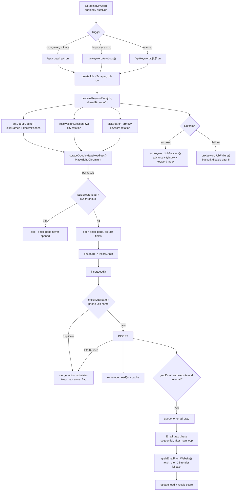
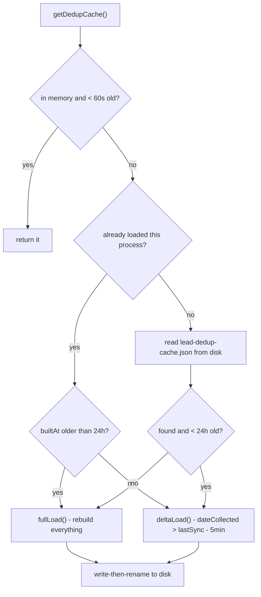

# DataForge — Scraping Pipeline & Deduplication

> ⚠️ **This is the product's core and the most protected code in the repo.** The scraping
> algorithm and the auto-keyword loop are off-limits unless the developer asks for a
> change to them **by name** — see [CLAUDE.md §C6](../CLAUDE.md). A change that looks
> harmless can quietly halve the leads collected, and nobody notices for days.
> This document explains how it works so you can read it, debug it, and stay out of it.

---

## 1. The pipeline end to end

```
[Keyword schedule] → [Job] → [Google Maps scrape] → [3-layer dedup] → [Lead row]
                                                          ↓
                                                  [Email grab phase]
```



---

## 2. What triggers a scrape

There are three entry points, all converging on `processKeywordJob()`.

| Trigger | Where | Behaviour |
|---|---|---|
| **Cron** (web) | `/api/scraping/cron`, every minute via `vercel.json` | Reaps dead jobs, enforces the run-time guard, enqueues due keywords up to the concurrency cap, then runs the whole batch under **one shared Chromium** via `waitUntil`. |
| **Auto-run loop** (desktop / dev) | `runKeywordAutoLoop()` in `jobs/processor.ts` | Keeps scraping one keyword back to back while `autoRun` is on, independent of any cron or browser tab. |
| **Manual** | `/api/keywords/[id]/run`, or a job created from the scraping UI | One job, immediately. |

`getDueKeywords()` returns keywords that are either `autoRun: true`, or `enabled` with
`nextRunAt` null or in the past.

### The cron tick, in order

1. **Authorize** — either `Bearer $CRON_SECRET` or Vercel's `x-vercel-cron: 1` header.
2. **Reap zombies** — any keyword job `running`/`pending` and untouched for > 3 minutes is
   marked `failed`. A serverless run cannot outlive ~300 s, so its Chromium is already
   dead while the DB row stays frozen at its last progress text. A live job writes progress
   after every lead (≤ ~40 s apart), so > 3 min stale reliably means dead.
3. **`enforceMaxAutoRunTime()`** — force-stop keywords that have been auto-running past
   `AppSettings.scrapingMaxRunMinutes` (turn `autoRun` off, set the live job to `paused`,
   notify the owner and boss/admin). Runs *before* enqueueing so a just-stopped keyword
   is not picked up again this tick.
4. **Count in-flight jobs** against the concurrency cap so a slow batch cannot pile up.
5. **Resume one stuck `pending` job** older than 2 minutes (at most one per tick).
6. **Enqueue due keywords** into the remaining slots, skipping any keyword that already has
   an active job. Overflow is **deferred**, not dropped — `nextRunAt` has not advanced, so
   the next tick picks it up.
7. **Run the batch** under one shared browser inside `waitUntil`, closing the browser when
   every scrape resolves.

Concurrency cap: `KEYWORD_SCRAPER_CONCURRENCY` env var (default 3) for the cron;
`AppSettings.scraperMaxConcurrency` (default 3) for the in-process loop, re-read every
iteration so it can be tuned live. Each concurrent scrape is a Chromium holding a heavy
Google Maps page, so this is a memory and DB-pool guard: 8 GB machine → 2–3, 32 GB → 6–8.

---

## 3. `runKeywordAutoLoop()` — the continuous mode

One loop per keyword per process (`activeAutoLoops` guards re-entry). Each iteration:

1. Re-read the keyword; **stop if `autoRun` went false** or the keyword was deleted.
2. Re-read settings so concurrency and the run-time limit can change live.
3. **Max-run-time guard** — mirrors the cron's, essential on desktop where no cron fires.
4. **Self-heal** — reap this keyword's own stale jobs (> 3 min untouched). Without this, a
   leftover `running` row would block the keyword forever on desktop.
5. Skip the iteration if a job is already active (cron or manual may have started one).
6. **Acquire a concurrency slot**, create a job, and run it under a **watchdog** —
   `Promise.race` against a 12-minute ceiling. A stalled job is marked `failed`, which the
   in-job status poll sees and turns into a clean cancel + browser close, so it cannot hold
   its slot forever and starve other keywords.
7. **Adaptive backoff.** If the run saved fewer than `max(3, 10% of maxLeads)` *new* leads,
   the keyword's "dry streak" increments; otherwise it resets.

| Dry streak | Pause before next cycle |
|---|---|
| 0 (productive) | 1.5 s — just let writes settle |
| 1 | 30 s |
| 2 | 1 min |
| 3 | 2 min |
| 4 | 4 min |
| n | `min(10 min, 30 s × 2^(n-1))` |

A duplicate-saturated keyword therefore stops burning a concurrency slot for near-zero
gain, and productive keywords get those slots instead.

---

## 4. `processKeywordJob()` — one run

```mermaid
sequenceDiagram
    participant J as processKeywordJob
    participant DB as Postgres
    participant C as dedup-cache
    participant S as maps-scraper
    participant W as email-grabber

    J->>DB: status = running, startTime
    J->>DB: poll status every 5s (cancellation)
    J->>C: getDedupCache() -> skipNames, knownPhones
    J->>J: resolveRunLocation(kw) - pick city
    J->>DB: record resolved city on the job

    loop attempt 0..2 (MAX_RETRIES)
        J->>J: pickSearchTerm(kw) - re-roll extras on retry
        J->>S: scrapeGoogleMapsHeadless(term, city, remaining, ...)
        loop per discovered business
            S->>S: isDuplicate(lead)? -> skip early
            S-->>J: onLead(lead)
            J->>DB: insertLead() (serialized via insertChain)
            J->>C: rememberLead() on success
            J->>DB: progress heartbeat (discovered/processed/dups)
        end
        J->>J: await insertChain; stop if cancelled/limit/target met
    end

    opt grabEmail enabled
        loop pending grabs (sequential)
            J->>DB: check status (force-stop?)
            J->>J: stop if past 285s budget
            J->>W: grabEmailFromWebsite(website) - 20s cap
            J->>DB: update lead email + recalculated score
        end
    end

    J->>DB: status = completed/failed/paused + counters
    J->>DB: onKeywordJobSuccess / onKeywordJobFailure
```

### Key numbers

| Constant | Value | Why |
|---|---|---|
| `MAX_RETRIES` | 2 (3 attempts) | Each retry re-rolls the extra keywords for a different search term |
| `MAX_SCRAPE_MS` | 200 s | Hard ceiling on the scrape phase |
| `FN_BUDGET_MS` | 285 s | ~15 s margin under Vercel's 300 s function limit; the email phase stops here so the job completes cleanly instead of being killed mid-grab and frozen at `running` |
| Cancellation poll | 5 s | Reads `ScrapingJob.status`; anything other than `running` sets the cancel flag |
| Per-site email cap | 20 s | One hanging site cannot stall the whole phase |
| Watchdog (auto-loop) | 12 min | Abandons a stalled job so it releases its concurrency slot |
| Zombie threshold | 3 min | Stale `updatedAt` on a `running` job |
| `MAX_KEYWORD_FAILURES` | 5 | After 5 consecutive failures the keyword is disabled (`enabled: false`, `nextRunAt: null`) |

### Insert serialization

Inserts are chained through a single `insertChain` promise rather than run in parallel.
Leads arrive from the scraper faster than the database can absorb them over this link, and
serializing keeps the connection pool available for everything else the app is doing. The
chain is always flushed (`await insertChain`) before deciding whether to retry and before
the job is finalized.

### Routing

If the keyword's `category` matches a real `Industry` on the leads board, its leads land in
that category's shared **"Ungrouped"** folder so they stay grouped. No match (or
`Uncategorized`) leaves them unfiled.

---

## 5. Rotation — how one keyword covers a whole market

### City rotation (`resolveRunLocation`)

| `location` shape | Behaviour |
|---|---|
| `"Austin, Texas, United States"` (3 parts) | Fixed city, used every run |
| `"Texas, United States"` (2 parts) | **Auto-cycles cities**, ordered by population, largest first, indexed by `cityIndex` |
| anything else, or `cityRotationEnabled: false` | Used verbatim |

Population data comes from `src/lib/geo/city-populations.json` (built by
`scripts/build-city-populations.mjs` from `cities1000`). Largest-first ordering means early
runs hit dense markets instead of burning the first dozen runs on whatever is
alphabetically first. The chosen city's coordinates are passed into the browser as a
**geolocation override**, so Google Maps centres on the target rather than the server's IP.

`cityIndex` increments only on a **successful** run.

### Keyword rotation (`pickSearchTerm`)

| Mode | Behaviour |
|---|---|
| `ordered` | Cycles one extra at a time via `extraKeywordsIndex` (using `extraKeywordsOrder` if the user picked a subset) — `dentist orthodontist`, then `dentist dental clinic`, … |
| `random` | Picks between `extraKeywordsMin` and `extraKeywordsMax` extras, shuffled — every run is a different combination |

In both modes the parts are **shuffled** so the main keyword is not always first, which
varies the query shape across runs.

---

## 6. The scraper itself

[`src/lib/scraping/google/maps-scraper.ts`](../dataforge-app-lite/src/lib/scraping/google/maps-scraper.ts)
(~46 KB) drives Playwright Chromium over Google Maps: search → results pagination → detail
page per business → field extraction.

Its contract with the caller is **fixed and must be preserved exactly**:

```ts
scrapeGoogleMapsHeadless(
  keyword, location, maxLeads,
  onLog?,                              // progress text -> job.errorMessage
  onLead?,                             // async callback per lead
  maxRuntimeMs?,
  isDuplicate?: (lead) => boolean,     // SYNCHRONOUS
  skipNames?: Set<string>,             // SYNCHRONOUS
  isCancelled?,
  overrideCoords?,
  sharedBrowser?,                      // one browser, many contexts
  boost?,
)
```

**The synchronous `skipNames` / `isDuplicate` contract is the entire reason the dedup cache
exists.** Making the check async would mean changing the scraper, which is not allowed —
so the key sets must be available in memory, which means they must be cached rather than
queried per batch.

Other behaviours built into it:

* **Anti-detection** — human-like mouse movement and scrolling, randomized delays, shuffled
  query part order, per-run geolocation.
* **Boost mode** (`AppSettings.scrapingBoost`) scales every pacing delay to ~25% of normal;
  even without boost it runs at ~60% of the original delays to cut function time. Faster,
  with a higher CAPTCHA/block risk.
* **Aggregator filtering** — directory domains (yelp, yellowpages, bbb, angi, houzz, …) are
  never treated as a business's own website. Using them for dedup would make every business
  linking to yelp.com look like the same lead.
* **Shared-browser mode** — with `sharedBrowser`, the scrape opens its own *context* inside
  the caller's browser, so N concurrent keywords cost ~1 Chromium process instead of N. The
  caller owns the browser's lifecycle.

`src/lib/scraping/crawler/` holds the supporting pieces: `core.ts` (browser launch,
stealth context, human-input helpers), `email-grabber.ts` (plain fetch first, JS-rendered
fallback only if needed — the browser context is created **lazily**, so a grab phase where
every site resolves by fetch never launches one), `parser.ts`, `web-crawler.ts`,
`web-scraper.ts`.

`src/lib/scraping/google/discovery.ts` is the **legacy SerpAPI path**, only active when
`SERPAPI_API_KEY` is set. Keyword jobs still record `source: "serpapi"` for historical
reasons but use the Playwright scraper.

---

## 7. Deduplication — three layers, three different jobs

**Do not "simplify" by removing a layer.** The local copy is allowed to be stale *precisely
because* the other two are authoritative.

| Layer | Where | Purpose | If it is stale or missing |
|---|---|---|---|
| **1. Local copy** | `jobs/dedup-cache.ts` | Skip a business *before* opening its detail page | Wasted scraping only — **never** a duplicate row |
| **2. `checkDuplicate()`** | `utils/dedup.ts`, called by `insertLead()` | Catch everything already committed, and merge into it | Duplicates across sessions |
| **3. Unique indexes** | Postgres expression indexes | Settle ties between concurrent writers | Two people scraping the same business at once both insert |

### Layer 1 — the local copy



* Lives at `%LOCALAPPDATA%\DataForge\cache\lead-dedup-cache.json` (override with
  `DEDUP_CACHE_DIR`). **Disabled on Vercel** — no durable disk — where it falls back to
  in-memory.
* Delta re-sync every **60 s** (`DEDUP_REFRESH_MS`) so leads added by *other* people and
  devices appear within a minute, not only after a restart. DataForge is scraped by several
  people at once.
* Every unique insert is appended by `rememberLead()`; writes are coalesced and flushed
  with **write-then-rename**, so a crash mid-write cannot leave a truncated cache.
* Concurrent callers share one in-flight load (`inflight`).
* Measured effect: **cold 4,456 ms → 561 ms on restart**, and the full-table read is gone
  from both the per-job and per-restart paths.

**Two invariants you must not remove** (CLAUDE.md C4):

1. **The 24-hour full rebuild** (`DEDUP_REBUILD_MS`). Leads are **hard-deleted in six
   places**. Without the rebuild the copy keeps deleted names forever and — because it
   drives the scraper's early skip — those businesses are *silently never collected again*.
2. **The 5-minute overlap window** on each delta, instead of a strict `>` cursor.
   Concurrent inserts can commit with a `dateCollected` behind one already observed; a
   strict cursor skips them permanently.

Diagnostics: `dedupCacheStatus()` (surfaced in the settings/fleet UI),
`invalidateDedupCache()`, `flushDedupCache()` on shutdown.

### Layer 2 and 3

See [`DATA_MODEL.md` §3–§5](DATA_MODEL.md#3-deduplication-invariants) for the query, the
index definitions, and why email is never a key.

---

## 8. The egress incident — why all of this exists

One line in `jobs/processor.ts`:

```ts
// FORMER BUG — do not reintroduce in any shape
const existingLeads = await prisma.lead.findMany({ select: { businessName: true, phone: true } });
```

* It read **every lead** into memory to build the skip set, **once per scraping job**.
* Measured against real data: 4.6 MB of payload, **≈7.6 MB on the wire**.
* `runKeywordAutoLoop` creates jobs back to back while `autoRun` is on; there are 16,644
  `ScrapingJob` rows.
* **11,614 jobs × 7.6 MB = 86.6 GB** — against a 5 GB quota (**1,732%**).
* It was **self-amplifying**: every job added leads, making the next job's read bigger.
  Cost scaled **quadratically** with the lead count.

Supabase applied Fair Use restrictions to the **whole organisation** (not one project):
every project returned HTTP 402 and the database refused pooler connections. Project
*transfer* is on the restricted list, so recovery meant restoring an NDJSON backup into a
fresh project.

### The shape of the fix — the standard to hold future changes to

The 2026-08 fix changed **exactly one line** inside `processKeywordJob` — `await
getDedupCache()` in place of the full-table `findMany` — plus swapping the two
set-mutation lines for `rememberLead()`. The `isDuplicate` body was left **byte-identical**
and verified so with a diff against `HEAD`.

> If `git diff` on `src/lib/scraping/google/` is not empty, you have gone too far.

**What is permissible** inside `processKeywordJob`: only *where the dedup key sets come
from*. Dedup, caching and egress work belongs in
`src/lib/scraping/jobs/dedup-cache.ts`, `src/lib/utils/dedup.ts` and `src/lib/leads/`.

---

## 9. Off-limits without an explicit, by-name request

| Path | What lives there |
|---|---|
| `src/lib/scraping/google/` (all of it) | The Google Maps scraper: pagination, detail pages, retries, stealth, `MAX_SCRAPE_MS` |
| `runKeywordAutoLoop()` — `jobs/processor.ts` | Job creation, stale-job reaping, run-time guards, concurrency |
| `processKeywordJob()` control flow | Attempts/retries, cancellation polling, insert chaining, email-grab queueing, progress heartbeats |
| `src/lib/keywords/service.ts` | `getDueKeywords`, `pickSearchTerm`, `resolveRunLocation`, `enforceMaxAutoRunTime`, `onKeywordJobSuccess/Failure` |
| `src/app/api/scraping/cron/route.ts` | Which jobs are enqueued per tick, and the concurrency cap |

---

## 10. Debugging a scrape

| Symptom | Look at |
|---|---|
| Job stuck at `running` with stale progress text | Function timeout. The cron reaps it after 3 min; on desktop the auto-loop does. Check `updatedAt`. |
| Keyword stopped scraping entirely | `failedAttempts >= 5` → `enabled: false`, `nextRunAt: null`. Check `lastError`. |
| "Auto-stopped — reached the N-minute run limit" | `AppSettings.scrapingMaxRunMinutes`. Turn `autoRun` back on. |
| Very few new leads per run | Duplicate saturation. Check the dry-streak backoff and whether city rotation has cycled through the dense cities. |
| Leads never collected for a business you know exists | Stale local copy holding a deleted name. Check `builtAt` via `dedupCacheStatus()`; the 24 h rebuild is what clears it. |
| Scrapes timing out / machine thrashing | Too many concurrent browsers. Lower `AppSettings.scraperMaxConcurrency` or `KEYWORD_SCRAPER_CONCURRENCY`. |
| CAPTCHAs / blocks | `scrapingBoost` is on. Turn it off for slower, safer pacing. |
| Nothing runs at all on web | Cron auth — `CRON_SECRET` or the `x-vercel-cron` header; check `scrapingGlobalPause`. |
